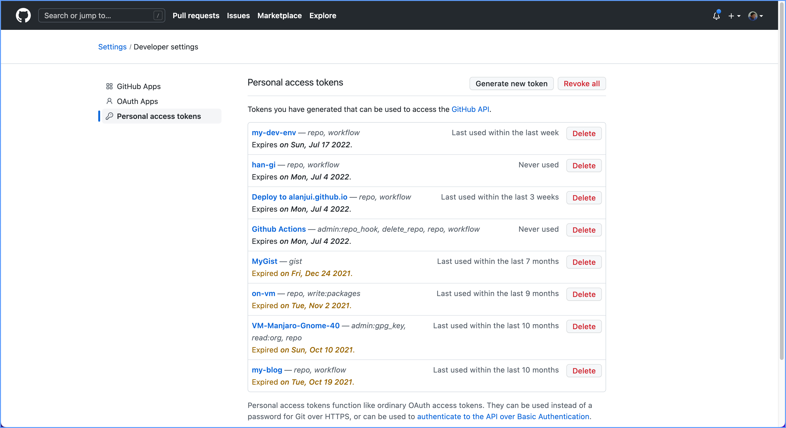
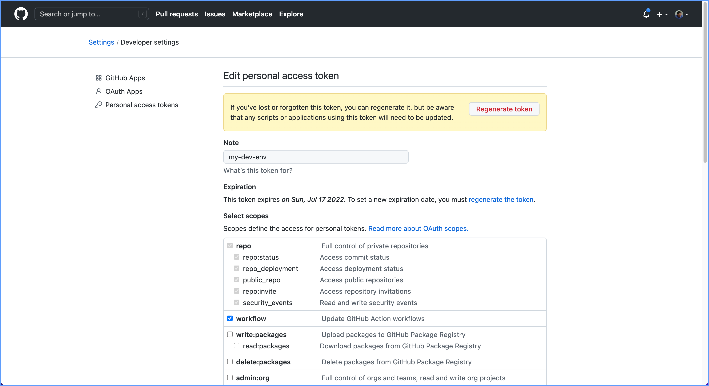
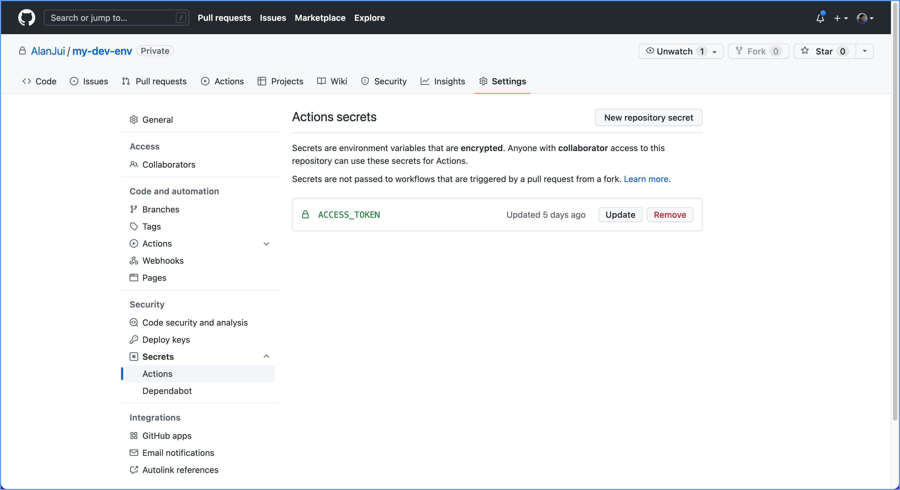
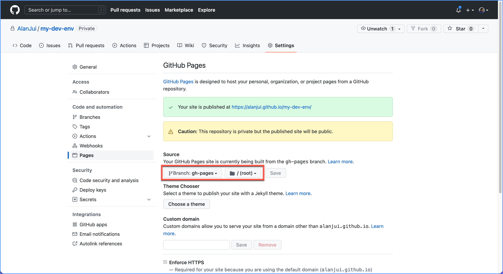

# 《技術文件模版使用指引》

使用 VuePress 平台，做為「技術文件模版」，以利「技術文件編輯與發行作業」更加便利。

本專案以：「使用 Manjaro KDE 作業系統，建置軟體開發環境為目標，透過實例展示，如
何將 VuePress 當成技術文件模版」。

## 安裝作業

### (1) 下載文件模版。

```
cd ~/workspace/docs
git clone git@github.com:AlanJui/my-docs.git [Project_Name]
```

### (2) 安裝 Node.js 套件

```
cd [Project_Name]
yarn install
```

### (3) 驗證 VuePress 已能正常運作。

1. 啟動編輯作業的預覽功能。 

```
yarn dev
```

2. 使用 Web 瀏覽器，檢視以下之「網址」，確認能顯示首頁之內容。

```
http://localhost:8080/my-docs/
```

## 設定作業

為使下載的「技術文件模版」，能改成「專案」所專用，故有下列之設定
工作待執行。

### (1) 建專案使用的 Repo 。

1. 使用 Web 瀏覽器，登入 GitHub 網站，建置專案使用的 Repo 。

2. 使用「終端機」輸入下列指令，用以設定專案與 GitHub Repo 的連結。

```
rm -rf .git
git init
git add .
git commit -m "Initial project"
git remote add origin [GitHub_Repo_URL]
git branch -M main
git push -u origin main
```

【備註】：

GitHub Repo 網址格式： git@github.com:[User_Name]/[Project_Name]

**範例**：

```
git remote add origin git@github.com:AlanJui/my-doc.git
```

### (2) 變更 VuePress 設定檔

存放 VuePress 設定檔「目錄路徑」與「檔案名稱」如下所示：

**[Project_Name]/docs/.vuepress/config.js**

```
module.exports = {
  title: "Manjaro KDE 開發環境建置指引",
  description: "如何在 Manjaro KDE 電腦建置開發環境",
  base: "/my-docs/",
  themeConfig: {
    nav: [
      { text: "首頁", link: "/" },
      { text: "作業系統", link: "/D01_OS/" },
      { text: "終端機", link: "/D02_Terminal/" },
      { text: "開發環境", link: "/D03_DevEnvironments/" },
      { text: "開發工具", link: "/D04_DevTools/" },
    ],
    sidebar: [
      "/",
      "/D01_OS/",
      "/D02_Terminal/",
      "/D03_DevEnvironments/",
      "/D04_DevTools/",
    ],
  },
  markdown: {
    lineNumbers: true,
  },
}
```

1. 將 `base: "/my-docs/"` 改成： `base: "/[Project_Name]/"`

2. 依專案應用的需求，變更下列兩項設定：
   - `nav: [...]` 
   - `sidebar: [...]` 

### (3) 變更佈署腳本設定檔

變更 GitHub Action 所使用的「佈署腳本設定檔」，令其適用於專案。

[Project_Name]/.github/workflows/vuepress-deploy.yml

```
name: Build and Deploy
on: [push]
jobs:
  build-and-deploy:
    runs-on: ubuntu-latest
    steps:
    - name: Checkout
      uses: actions/checkout@master

    - name: vuepress-deploy
      uses: jenkey2011/vuepress-deploy@master
      env:
        ACCESS_TOKEN: ${{ secrets.ACCESS_TOKEN }}
        TARGET_REPO: AlanJui/my-dev-env
        TARGET_BRANCH: gh-pages
        BUILD_SCRIPT: yarn && yarn build
        BUILD_DIR: docs/.vuepress/dist
        CNAME: https://alanjui.github.io/my-dev-env/
```

1. 變更 `TARGET_REPO` 欄的設定，改成 `[User_Name]/[Project_Name]` 。

2. 確認 `TARGET_BRANCH` 欄，其值應為： `gh-pages` ，不是 `main` ；或 `master` 。

3. 確認 `BUILD_SCRIPT` 欄之設定值。此處之設定值，應用 package.json 檔，第 8 行
   之設定 `"build": "buepress build docs",` 。

    【附註】：
    VuePress 官網之 Quick Start 教學，其範例對於 build 作業，所使用的 script 名稱
    命名為： `docs:build` ；但在「佈署教學」的範例，卻又改名為： `build` 。此結果
    將造成 GitHub Actions 的佈署作業，因為在 package.json 設定檔內，找不到名為
    build 的 script ，而致佈署作業無法完成。

4. 若有必要，變更 `CNAME` 欄之設定值。不然，整行刪除亦可。

## 編輯作業

1. 啟動「編輯預覽」功能。

```
yarn dev
```

2. 使用「瀏覽器」預覽 Markdown 文檔所轉成的網頁。

```
http://localhost:8080/[Project_Name]
```

3. 啟動「編輯器」，執行進行「技術文件」的編輯工作。

```
nvim
```

## 組建作業

1. 執行「文件發行建構作業」。

```
yarn build
```

2. 啟動專案檢視用的簡易 HTTP 伺服器。

```
yarn review
```

3. 透過「瀏覽器」觀察網頁，能否正常顯示。

```
http://localhost:8080/[Project_Name]
```

## 佈署前置作業

GitHub 提供的 Actions 功能，可透過「佈署腳本檔」的設定，自動將 VuePress 
的 Markdown 檔案，轉成 GitHub Pages 。

- GitHub Repo 網址： https://[User_Name].github.io/[Project_Name]/ 
- GitHub Pages 網址：https://[User_Name].github.io/[Project_Name]/

### (1) 建置專案使用的 Secrets

因為 GitHub 需要確認「佈署腳本」的執行，是否擁有足夠的權限：故使用者需在
GitHub 的「使用者設定」中，建置專案用的 Secrets (Personal Access Token) 。

1. 添加 Personal access tokens 設定。

[User_Name]/Settings/Developer settings/Personal access
tokens/Generate new token



2. 設定 Token 的使用權限。

Token scopes:
- repo (all)
- workflow



### (2) 設定 GitHub Action 使用的 Secrets

設定 GitHub Action 作業時，所使用的 Screts（Personal Access Token）。
以便 GitHub 可驗證其「使用及存取權限」。

在 GitHub 網站，專案的 Repo，執行【New repository secret】功能，
用以建立專案所用之 Secrets 。

**【指令路徑】**：

```
[Project_Name]/Settings/Security/Secrets/Actions/New repository secret
```

【註】：完成設定儲存時，其名稱應為：ACCESS_TOKEN 。



### (3) 設定組建作業取用的 Branch

GitHub Pages 之組建(Build)作業，可透過「GitHub Action」功能達成。因為每個
檔案倉(Repo) 可附帶好幾個「分支（Branch）」，故以下之設定，主在告知 Repo ，
產生 GitHub Pages 靜態網頁，應自那個 Branch 取用。

在 GitHub 網站，專案的 Repo，執行【Source】設定功能，用以指定專案組建
GitHub Pages ，應使用 Repo 的 gh-pages branch；而 GitHub Pages 靜態網站，
其網頁檔案的「起始目錄」位於 root 路徑處。

**【指令路徑】**：

```
[Project_Name]/Settings/Code and automation/Pages/Source
```

**【設定內容】**：
- Branch: gh-pages
- Dir: /(root)



## 佈署作業

執行 git push 指令，將檔案存入 GitHub 。便能觸發「佈署作業」之執行。

```
$ git push
```

## 參考文件

### [GitHub Pages and GitHub Actions](https://vuepress.vuejs.org/guide/deploy.html#github-pages)
官網指引文件，說明如何在 GitHub Repo ，透過 GitHub Actions 功能，佈署 GitHub
Pages 靜態網站。

### 版本管控設定作業

VuePress 執行「組建（Build）作業」時，其。其產出所置放的「目錄路徑」為： 
`<Project_Name>/docs/.vuepress/dist/` 。

上述目錄之下的所有檔案，由於無需進行版本管控，故需進行「設定」， 要求 git 怱略。

編輯「Git 怱略設定檔」： .gitignore ，加入「應怱略檔案」所在的目錄路徑。

```
$ vim .gitignore
```

在 .gitignore 檔案應加入的「設定」內容：

```
....
docs/.vuepress/dist/
```


